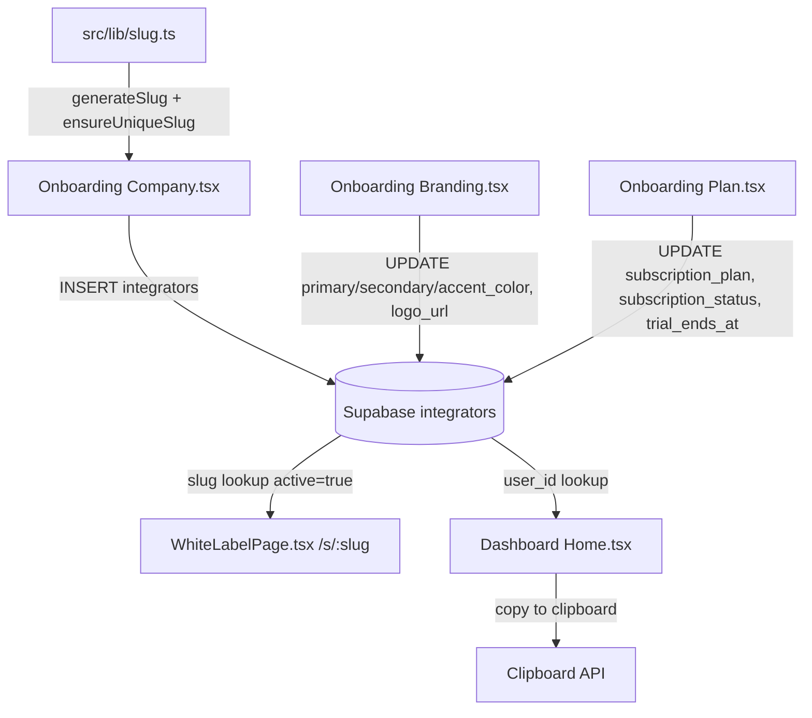

# Design Document — white-label-site-activation

## Overview

Esta feature resolve o problema central do SaaS: o fluxo de onboarding não persiste dados na tabela `integrators`, fazendo com que `/s/{slug}` retorne "Página não disponível". A solução envolve quatro frentes:

1. **Geração de slug** — função pura `generateSlug` + verificação de unicidade `ensureUniqueSlug` via Supabase
2. **Persistência no onboarding** — Company.tsx insere o registro; Branding.tsx e Plan.tsx fazem upsert dos campos restantes
3. **Carregamento robusto do site white-label** — WhiteLabelPage.tsx distingue três estados de erro (não encontrado, inativo, falha de rede)
4. **Exibição do link no dashboard** — Home.tsx busca o registro do integrador autenticado e exibe o link com botão copiar

O projeto usa React 18 + TypeScript + Supabase JS v2 + React Router v6 + Vitest + @testing-library/react.

---

## Architecture



O fluxo de dados é unidirecional: cada etapa do onboarding escreve no Supabase, e as páginas públicas/dashboard apenas leem.

---

## Components and Interfaces

### `src/lib/slug.ts` — novo arquivo

Exporta duas funções puras (sem efeitos colaterais de rede):

```typescript
/** Converte um nome de empresa em slug kebab-case sem acentos */
export function generateSlug(companyName: string): string

/** Verifica unicidade no Supabase e adiciona sufixo incremental se necessário */
export async function ensureUniqueSlug(
  baseSlug: string,
  supabaseClient: SupabaseClient
): Promise<string>
```

`generateSlug` é uma função pura — recebe string, retorna string — facilitando testes unitários sem mock de rede.

`ensureUniqueSlug` recebe o cliente Supabase como parâmetro (injeção de dependência) para facilitar testes.

### `src/pages/onboarding/Company.tsx` — modificado

- Importa `generateSlug` e `ensureUniqueSlug`
- Exibe prévia do slug em tempo real (derivado do estado `companyName`)
- No `handleSubmit`: chama `ensureUniqueSlug`, depois `supabase.from('integrators').insert(...)` com `active: true`
- Em caso de erro: exibe toast de erro e **não navega**

### `src/pages/onboarding/Branding.tsx` — modificado

- No submit: `supabase.from('integrators').update({ primary_color, secondary_color, accent_color, logo_url }).eq('user_id', user.id)`
- Usa `useAuth()` para obter `user.id`

### `src/pages/onboarding/Plan.tsx` — modificado

- No submit: `supabase.from('integrators').update({ subscription_plan, subscription_status: 'trial', trial_ends_at }).eq('user_id', user.id)`
- `trial_ends_at` = `new Date(Date.now() + 7 * 24 * 60 * 60 * 1000).toISOString()`

### `src/pages/public/WhiteLabelPage.tsx` — modificado

Introduz três estados de erro distintos:

```typescript
type ErrorType = 'not_found' | 'inactive' | 'network_error' | null
```

- `not_found`: slug não existe na tabela
- `inactive`: registro existe mas `active = false`
- `network_error`: erro de rede/Supabase

### `src/pages/dashboard/Home.tsx` — modificado

- Busca `integrators` pelo `user_id` do `useAuth()`
- Exibe link `{window.location.origin}/s/{slug}` como texto somente leitura
- Botão "Copiar Link" usa `navigator.clipboard.writeText` + toast de confirmação
- Se não encontrar registro: exibe card orientando a completar o onboarding

---

## Data Models

### Tabela `integrators` (existente, sem alteração de schema)

| Campo | Tipo | Preenchido em |
|---|---|---|
| `user_id` | uuid | Company (INSERT) |
| `company_name` | text | Company (INSERT) |
| `slug` | text unique | Company (INSERT) |
| `active` | boolean | Company (INSERT, valor: `true`) |
| `primary_color` | text | Branding (UPDATE) |
| `secondary_color` | text | Branding (UPDATE) |
| `accent_color` | text | Branding (UPDATE) |
| `logo_url` | text | Branding (UPDATE) |
| `subscription_plan` | enum | Plan (UPDATE) |
| `subscription_status` | enum | Plan (UPDATE, valor: `'trial'`) |
| `trial_ends_at` | timestamptz | Plan (UPDATE, now + 7d) |

### Algoritmo `generateSlug`

```
1. Normalizar para NFD (decompõe acentos)
2. Remover diacríticos (Unicode category Mn)
3. Converter para minúsculas
4. Substituir qualquer sequência de [^a-z0-9] por hífen
5. Remover hífens duplicados consecutivos
6. Remover hífens no início e fim
7. Truncar para 60 caracteres
8. Se length < 3: concatenar sufixo de 4 dígitos aleatórios
```

### Algoritmo `ensureUniqueSlug`

```
1. Consultar integrators WHERE slug = baseSlug
2. Se não existir: retornar baseSlug
3. Se existir: tentar baseSlug-2, baseSlug-3, ... até encontrar livre
4. Máximo de 100 tentativas (proteção contra loop infinito)
```

---

## Correctness Properties

*A property is a characteristic or behavior that should hold true across all valid executions of a system — essentially, a formal statement about what the system should do. Properties serve as the bridge between human-readable specifications and machine-verifiable correctness guarantees.*

### Property 1: Formato válido do slug

*For any* string de nome de empresa, o slug gerado por `generateSlug` deve conter apenas caracteres `[a-z0-9-]`, não deve começar nem terminar com hífen, e não deve conter hífens consecutivos.

**Validates: Requirements 1.1, 6.1, 6.2, 6.3**

### Property 2: Tamanho do slug

*For any* string de nome de empresa com pelo menos um caractere alfanumérico, o slug gerado deve ter entre 3 e 60 caracteres.

**Validates: Requirements 6.4, 6.5**

### Property 3: Unicidade do slug

*For any* conjunto de slugs existentes e qualquer nome de empresa, `ensureUniqueSlug` deve retornar um slug que não está presente no conjunto de slugs existentes.

**Validates: Requirements 1.2**

### Property 4: Idempotência do upsert (active sempre true)

*For any* submissão da etapa Company, o registro inserido na tabela `integrators` deve ter `active = true`.

**Validates: Requirements 2.3, 1.4**

### Property 5: Trial ends_at é 7 dias no futuro

*For any* submissão da etapa Plan, o campo `trial_ends_at` salvo deve ser igual a `now + 7 dias` (com tolerância de ±1 segundo para execução).

**Validates: Requirements 2.2**

### Property 6: Upsert não cria duplicatas

*For any* `user_id`, submeter o onboarding duas vezes deve resultar em exatamente um registro na tabela `integrators` para aquele `user_id`.

**Validates: Requirements 2.4**

### Property 7: Formato do link no dashboard

*For any* integrador com slug `s`, o link exibido no dashboard deve ser igual a `{origin}/s/{s}`.

**Validates: Requirements 5.1**

### Property 8: Filtragem por active no carregamento do site

*For any* slug, se o registro correspondente tiver `active = false`, a página white-label não deve renderizar o conteúdo do integrador.

**Validates: Requirements 3.1, 4.2**

---

## Error Handling

### Company.tsx — falha no INSERT

- Exibir toast com mensagem descritiva (ex: "Erro ao salvar dados da empresa. Tente novamente.")
- Não navegar para a próxima etapa
- Manter o formulário preenchido

### Branding.tsx / Plan.tsx — falha no UPDATE

- Exibir toast de erro
- Não navegar

### WhiteLabelPage.tsx — três casos distintos

```typescript
// Lógica de carregamento
const { data, error } = await supabase
  .from('integrators')
  .select('*')
  .eq('slug', slug)
  .maybeSingle()

if (error) → errorType = 'network_error'
else if (!data) → errorType = 'not_found'
else if (!data.active) → errorType = 'inactive'
else → renderizar site
```

| Estado | Título | Ação disponível |
|---|---|---|
| `not_found` | "Página não encontrada" | Botão "Voltar ao início" |
| `inactive` | "Site temporariamente indisponível" | Mensagem de contato |
| `network_error` | "Erro ao carregar a página" | Botão "Tentar novamente" |

### Dashboard Home.tsx — sem registro

- Exibir card com mensagem "Complete seu cadastro para ativar seu site" + link para `/onboarding/company`

---

## Testing Strategy

### Abordagem dual

- **Testes unitários** (Vitest + @testing-library/react): exemplos específicos, casos de borda, estados de erro de UI
- **Testes de propriedade** (fast-check): propriedades universais sobre `generateSlug` e lógica de negócio pura

> fast-check é a biblioteca de property-based testing para TypeScript/JavaScript. Deve ser adicionada como devDependency: `npm install --save-dev fast-check`

### Testes unitários

Focados em:
- Renderização dos três estados de erro do WhiteLabelPage
- Exibição do spinner durante loading
- Exibição do link e botão copiar no Dashboard
- Exibição da mensagem de onboarding incompleto no Dashboard
- Comportamento do formulário Company em caso de erro de INSERT

### Testes de propriedade (fast-check)

Cada teste de propriedade deve rodar mínimo 100 iterações. Tag de referência no comentário do teste:

`// Feature: white-label-site-activation, Property {N}: {texto}`

**Property 1 — Formato válido do slug**
```typescript
// Feature: white-label-site-activation, Property 1: Formato válido do slug
fc.assert(fc.property(fc.string(), (name) => {
  const slug = generateSlug(name.length > 0 ? name : 'a')
  return /^[a-z0-9][a-z0-9-]*[a-z0-9]$|^[a-z0-9]$/.test(slug)
    && !slug.includes('--')
}), { numRuns: 100 })
```

**Property 2 — Tamanho do slug**
```typescript
// Feature: white-label-site-activation, Property 2: Tamanho do slug
fc.assert(fc.property(fc.string({ minLength: 1 }), (name) => {
  const slug = generateSlug(name)
  return slug.length >= 3 && slug.length <= 60
}), { numRuns: 100 })
```

**Property 3 — Unicidade do slug** (requer mock do Supabase)
```typescript
// Feature: white-label-site-activation, Property 3: Unicidade do slug
// Gerar conjunto aleatório de slugs existentes, verificar que o resultado não está no conjunto
```

**Property 5 — Trial ends_at é 7 dias no futuro**
```typescript
// Feature: white-label-site-activation, Property 5: Trial ends_at é 7 dias no futuro
// Testar a função de cálculo de trial_ends_at com datas arbitrárias
```

**Property 7 — Formato do link no dashboard**
```typescript
// Feature: white-label-site-activation, Property 7: Formato do link no dashboard
fc.assert(fc.property(fc.string({ minLength: 1 }), (slug) => {
  const link = buildWhiteLabelUrl(slug)
  return link === `${window.location.origin}/s/${slug}`
}), { numRuns: 100 })
```
